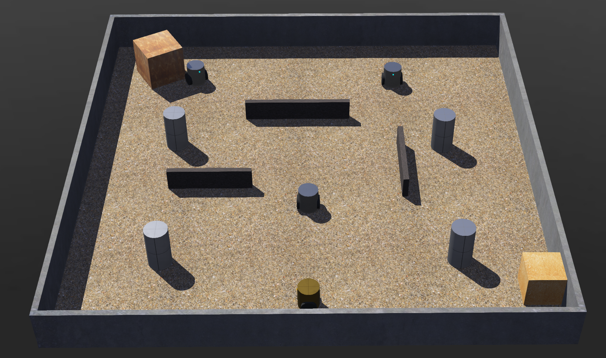
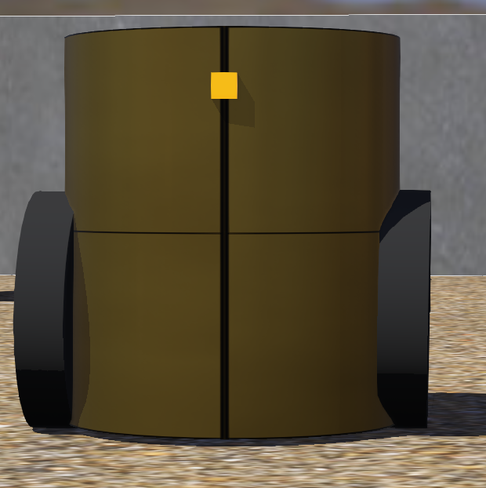
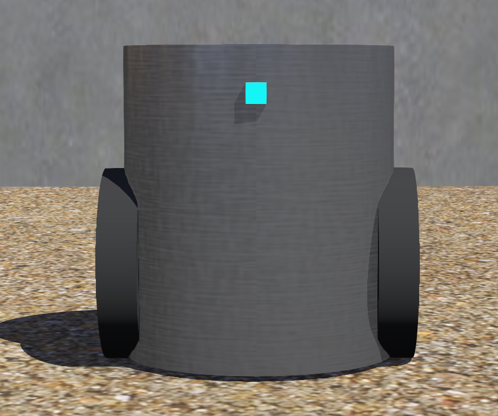
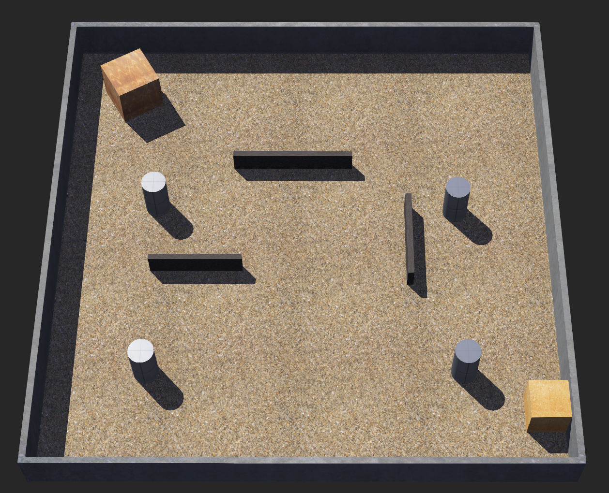

# 3CEB Robotics

[](https://cyberbotics.com/)
[](https://www.python.org/)

> A sophisticated multi-agent robotics simulation implementing autonomous tag game behavior using state machine architecture, odometry-based navigation, and wireless inter-agent communication in the Webots environment.

## Table of Contents

- [Overview](#overview)
- [Features](#features)
- [Authors](#authors)
- [Game Mechanics](#game-mechanics)
- [System Architecture](#system-architecture)
- [Robot Specifications](#robot-specifications)
- [Technical Implementation](#technical-implementation)
- [Installation & Setup](#installation--setup)
- [Configuration](#configuration)
- [Known Limitations](#known-limitations)

## Overview

This project demonstrates advanced autonomous robotics concepts through a competitive tag game scenario. The simulation features one hunter robot pursuing three runner robots within a constrained arena environment. The implementation showcases real-time decision-making, sensor fusion, inter-agent communication, and reactive behaviors essential for multi-agent robotic systems.



## Features

- **State Machine Controllers**: Robust finite state machines for both hunter and runner agents
- **Odometry Integration**: Wheel encoder-based position tracking with GPS fallback
- **Wireless Communication**: Real-time position broadcasting between agents
- **Obstacle Avoidance**: IR sensor-based reactive collision avoidance
- **Recovery Mechanisms**: Automated stuck detection and escape behaviors
- **Dynamic Gameplay**: Adaptive time bonuses and real-time game state management

## Authors

| Name | Role |
|------|------|
| Adrián Pérez | Developer |
| Jose Suárez | Developer |
| Sergio Romano | Developer |
| Nicolás Pertierra | Developer |

## Game Mechanics

### Objective

The hunter robot (red) must capture all three runner robots (blue) before time expires. Runners must evade capture until the timer reaches zero.

### Rules

| Parameter | Value | Description |
|-----------|-------|-------------|
| Base Duration | 120 seconds | Initial game time |
| Time Bonus | +30 seconds | Added per successful capture |
| Capture Range | 0.12 meters | Distance threshold for capture |
| Arena Size | 1.6m × 1.6m | Rectangular playing field |
| Victory Condition (Hunter) | Capture all 3 runners | Before timeout |
| Victory Condition (Runners) | Survive | Until timer expires |

## System Architecture

### Directory Structure

```
robotics-final/
├── controllers/
│   ├── chaser_controller/
│   │   └── chaser_controller.py       # Hunter robot behavioral controller
│   ├── game_supervisor/
│   │   └── game_supervisor.py         # Simulation supervisor and referee
│   └── target_controller/
│       └── target_controller.py       # Runner robot behavioral controller
├── protos/
│   └── TagBot.proto                   # Custom robot PROTO definition
├── textures/
│   └── ...                            # Environment textures and assets
├── worlds/
│   ├── tarea_final.wbt                # Main simulation environment
│   └── .tarea_final.wbproj            # Webots project configuration
└── README.md
```

### Component Onfiguration

Each robot is equipped with the following components:

| Component | Type | Quantity | Specification |
|-----------|------|----------|---------------|
| Motors | Rotational Motors | 2 | motor_1 (left), motor_2 (right), maxVelocity: 20 rad/s |
| GPS | Global Positioning | 1 | Position estimation fallback |
| Compass | Orientation Sensor | 1 | Heading measurement |
| Distance Sensors | Infra-red | 2 | ds_front_left, ds_front_right, range: 0-0.2m |
| Wheel Encoders | Position Sensors | 2 | ps_1 (left), ps_2 (right) for odometry |
| Receiver | Wireless | 1 | Inter-agent messaging (channel-based) |

### Physical Parameters

```
Wheel Radius:     0.025 m
Wheelbase:        0.09 m
Body Radius:      0.035 m
Maximum Speed:    Variable by agent type
```

## Robot Specifications

### Component Configuration

**Sensors and Actuators**:
- **Differential Drive**: Two independent motors (motor_1, motor_2)
- **GPS**: Global positioning for position estimation fallback
- **Compass**: Orientation sensor for heading measurement
- **Infrared Sensors**: 2x front-facing distance sensors for obstacle detection
- **Wheel Encoders**: 2x position sensors for odometry calculation
- **Wireless Transceiver**: Inter-agent messaging and communication

### Hunter Robot (Chaser)

**Controller**: [`chaser_controller.py`](controllers/chaser_controller/chaser_controller.py)



**Performance Profile**:

| Parameter | Value |
|-----------|-------|
| Maximum Speed | 18.0 rad/s |
| Base Speed | 14.0 rad/s |
| Proportional Gain | 3.0 |

**Behavioral States**:

- **SEARCH**: Executes random exploration patterns when no targets are detected
- **CHASE**: Pursues nearest runner using proportional heading control
- **AVOID**: Performs committed obstacle avoidance maneuvers
- **RECOVERY**: Activates stuck detection and escape sequences
- **CLEAR**: Clears obstacle area after avoidance maneuver

**Key Capabilities**:
- Differential odometry with GPS fallback for position tracking
- Timeout-based recovery mechanisms

### Runner Robots (Targets)

**Controller**: [`target_controller.py`](controllers/target_controller/target_controller.py)



**Performance Profile**:

| Parameter | Value |
|-----------|-------|
| Maximum Speed | 6.0 rad/s |
| Base Speed | 5.0 rad/s |
| Speed Disadvantage | 33% slower than hunter |

**Behavioral States**:

- **WANDER**: Executes exploratory random movement patterns
- **AVOID**: Performs reactive obstacle avoidance
- **RECOVERY**: Activates stuck escape sequences

### Supervisor System

**Controller**: [`game_supervisor.py`](controllers/game_supervisor/game_supervisor.py)

The simulation supervisor manages all game logic and state:

**Responsibilities**:

| Function | Description |
|----------|-------------|
| Position Broadcasting | Real-time agent position transmission via channels |
| Capture Detection | Distance-based collision detection (0.12m threshold) |
| Time Management | Game timer and bonus time allocation (+30s per capture) |
| Victory Evaluation | Win/loss condition assessment |
| HUD Display | On-screen time remaining and prey count display |
| Agent Lifecycle | Robot node removal upon capture |
| Simulation Control | Pause simulation when game ends |

**Communication Architecture**:

| Channel | Direction | Payload |
|---------|-----------|---------|
| Channel 1 | Supervisor → Runners | Hunter position and capture notifications |
| Channel 2 | Supervisor → Hunter | All active runner positions |

**Features**:
- Receives hunter position and capture notifications via wireless communication
- Stops movement when captured
- Lower speed than hunter (asymmetric gameplay)

### Odometry Integration

Both hunter and runner robots implement differential odometry-based dead reckoning with the following kinematic model:

```python
# Compute linear and angular displacement
d_center = (dist_left + dist_right) / 2
d_theta = (dist_right - dist_left) / wheelbase

# Update pose estimate
x += d_center * cos(heading)
y += d_center * sin(heading)
heading += d_theta
```

**Fallback Strategy**: GPS/compass measurements are used when wheel encoders are unavailable.

### State Machine Architecture

The behavioral controllers implement finite state machines with the following characteristics:

- **Timer-based Commitment**: State transitions include hysteresis to prevent oscillation
- **Priority Hierarchy**: Higher-priority states preempt lower-priority ones
- **Calibrated Thresholds**: Sensor thresholds are tuned for arena geometry

**State Transition Logic**:
```
RECOVERY (highest priority)
    ↓
AVOID
    ↓
CLEAR (Hunter only)
    ↓
CHASE
    ↓
SEARCH/WANDER (lowest priority)
```

## Installation & Setup

### Prerequisites

| Requirement | Version | Notes |
|-------------|---------|-------|
| Webots | R2025a or later | [Download](https://cyberbotics.com/) |
| Python | 3.7+ | Included with Webots |
| Webots Python API | Bundled | Automatically available |

### Installation Steps

1. **Install Webots**:
   ```bash
   # Download from https://cyberbotics.com/
   # Follow platform-specific installation instructions
   ```

2. **Clone Repository**:
   ```bash
   git clone <repository-url>
   cd robotics-final
   ```

3. **Open Simulation**:
   - Launch Webots
   - Open [`worlds/tarea_final.wbt`](worlds/tarea_final.wbt)
   - Click the play button to start the simulation

## Arena Layout

The simulation environment features:

| Element | Specification | Quantity |
|---------|---------------|----------|
| Arena Dimensions | 1.6m × 1.6m | 1 |
| Perimeter Walls | Height: 0.15m | 4 |
| Cylindrical Pillars | Radius: 0.04m, Height: 0.15m | 4 |
| Internal Wall Segments | Various lengths | 5 |
| Box Obstacles | 0.12-0.15m dimensions | 2 |
| Floor Texture | Tiled grass pattern | 1 |

**Initial Positions**: Robot spawn points are strategically distributed to ensure balanced gameplay.



## Configuration

### Tunable Parameters

All key parameters can be adjusted in their respective controller files:

#### Game Supervisor ([`game_supervisor.py`](controllers/game_supervisor/game_supervisor.py))

```python
GAME_DURATION = 120.0      # Base game time (seconds)
TIME_BONUS = 30.0          # Bonus per capture (seconds)
CAPTURE_DISTANCE = 0.12    # Capture threshold (meters)
```

#### Hunter Controller ([`chaser_controller.py`](controllers/chaser_controller/chaser_controller.py))

```python
MAX_SPEED = 18.0           # Maximum angular velocity (rad/s)
BASE_SPEED = 14.0          # Cruising angular velocity (rad/s)
TURN_GAIN_CHASE = 3.0      # Heading control gain
MAX_ACCEL = 0.8            # Max wheel speed change per step
```

#### Runner Controller ([`target_controller.py`](controllers/target_controller/target_controller.py))

```python
MAX_SPEED = 6.0            # Maximum angular velocity (rad/s)
BASE_SPEED = 5.0           # Cruising angular velocity (rad/s)
MAX_ACCEL = 0.7            # Max wheel speed change per step
```

### Performance Tuning

To modify gameplay balance:
- **Increase difficulty**: Reduce runner MAX_SPEED (currently 6.0) or increase hunter MAX_SPEED (currently 18.0)
- **Decrease difficulty**: Increase TIME_BONUS (currently 30.0s) or GAME_DURATION (currently 120.0s)
- **Adjust responsiveness**: Modify TURN_GAIN_CHASE (currently 3.0) or MAX_ACCEL values (0.8 hunter, 0.7 runner)
- **Adjust capture sensitivity**: Modify CAPTURE_DISTANCE (currently 0.12m)

## Known Limitations

The following behaviors are expected within the current implementation:

| Behavior | Cause | Mitigation |
|----------|-------|------------|
| Corner entrapment | Local minima during collision avoidance | Recovery state with 30-step timeout and random direction |
| Oscillatory avoidance | Reactive behavior near obstacles | State commitment timers (12 steps avoid, 10 steps clear) |
| Suboptimal paths | Greedy nearest-target selection | Acceptable for reactive chase behavior |
| No path planning | Real-time reactive control approach | Direct heading-based navigation with proportional control |
| Stuck detection delay | Counter-based accumulation | 40-step threshold before recovery activation |

## Contributing

Contributions are welcome! Please follow these guidelines:

1. Fork the repository
2. Create a feature branch (`git checkout -b feature/improvement`)
3. Commit your changes (`git commit -am 'Add new feature'`)
4. Push to the branch (`git push origin feature/improvement`)
5. Create a Pull Request

### Development Guidelines

- Follow PEP 8 style guidelines for Python code
- Add comments for complex logic
- Test changes in simulation before submitting
- Update README for significant feature additions

## Acknowledgments

- Webots development team for the simulation platform
- Course instructors and teaching assistants
- All team members for their contributions

---